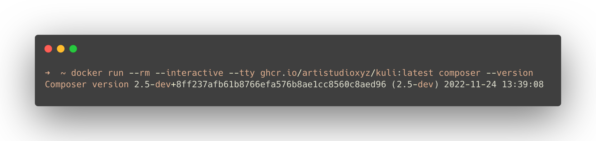

Isolated environment for building javascript and php project


<table>
    <tbody>
        <tr>
            <td>Packages</td>
            <td class="grid grid-cols-6">
                
                
            </td>
        </tr>
    </tbody>
</table>

## 📚 Installation
- via Docker Run : `docker run --rm --interactive --tty ghcr.io/artistudioxyz/kuli:latest <command>`
- via Docker Run with Mount Volume :
```
docker run --rm --interactive --tty \
    --volume $PWD:/app \
    ghcr.io/artistudioxyz/kuli:latest <command>
```

- Sample Command :
    - Composer : `composer update`
    - Node : `npm i`

## 🔥 Development
- Manually build package : `docker-compose up --build`